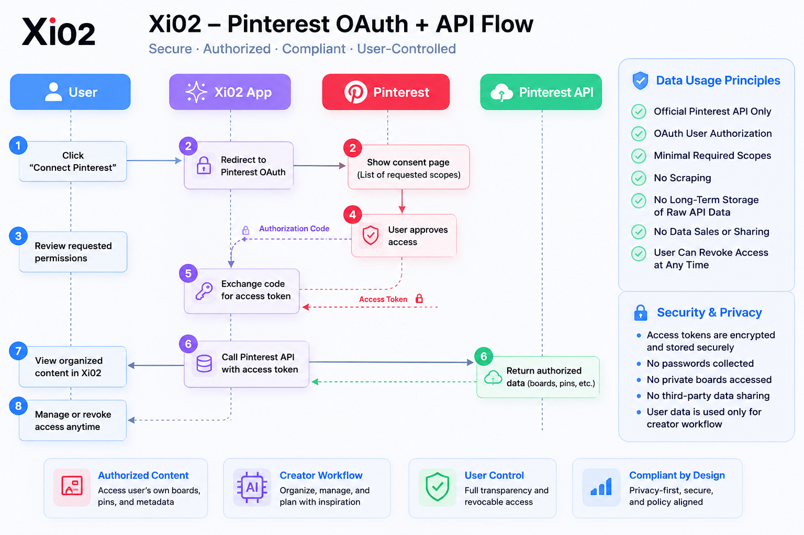

# Xi02 Developer Compliance Documentation

## Overview

Xi02 is a creator workflow assistant that helps users organize and manage their own Pinterest content through the official Pinterest API.

Xi02 is designed to support:

* Content organization
* Board management
* Pin management
* Inspiration collection
* Creator productivity workflows

Xi02 is not a platform analytics service, benchmarking tool, competitor intelligence system, or market research product.

---

## OAuth + API Flow

  

This diagram illustrates how Xi02 securely accesses Pinterest content using the official OAuth 2.0 authorization flow and Pinterest APIs.

Key principles:

* Official Pinterest API only
* OAuth user authorization required
* Minimal requested scopes
* No scraping
* No unauthorized access
* User-controlled permissions

---

## Requested Initial Scopes

Xi02 initially requests only the minimum permissions necessary to support user-authorized workflow features:

| Scope              | Purpose                        |
| ------------------ | ------------------------------ |
| user_accounts:read | Read basic account information |
| boards:read        | Read user boards               |
| pins:read          | Read user pins                 |

No write permissions are requested during the initial application.

---

## Data Usage Principles

Xi02 follows a privacy-first and data-minimization approach.

Xi02:

* Accesses Pinterest data only through the official Pinterest API
* Uses Pinterest data only for the authenticated user's workflow
* Does not scrape Pinterest
* Does not access private content without authorization
* Does not sell or share Pinterest-derived information
* Does not provide platform-wide analytics or competitor benchmarking

---

## Security & Privacy

Xi02 implements the following security principles:

* OAuth 2.0 Authorization Code Flow
* Secure token storage
* Least-privilege scope requests
* User-controlled access and revocation
* No password collection
* No credential harvesting

Users may revoke access at any time through Pinterest account settings.

---

## Privacy Policy

For detailed information regarding data handling and privacy practices, see:

[privacy-policy.md](privacy-policy.md)

---

## Compliance Statement

Xi02 is designed to operate in accordance with:

* Pinterest Developer Guidelines
* Pinterest Developer Terms of Service
* Pinterest OAuth Authorization Requirements
* Industry-standard privacy and security practices

---

## Project Information

Project: Xi02

Website:

https://www.xi02.com

Repository Purpose:

Developer compliance documentation, privacy policy, and OAuth flow reference for Pinterest API integration.
